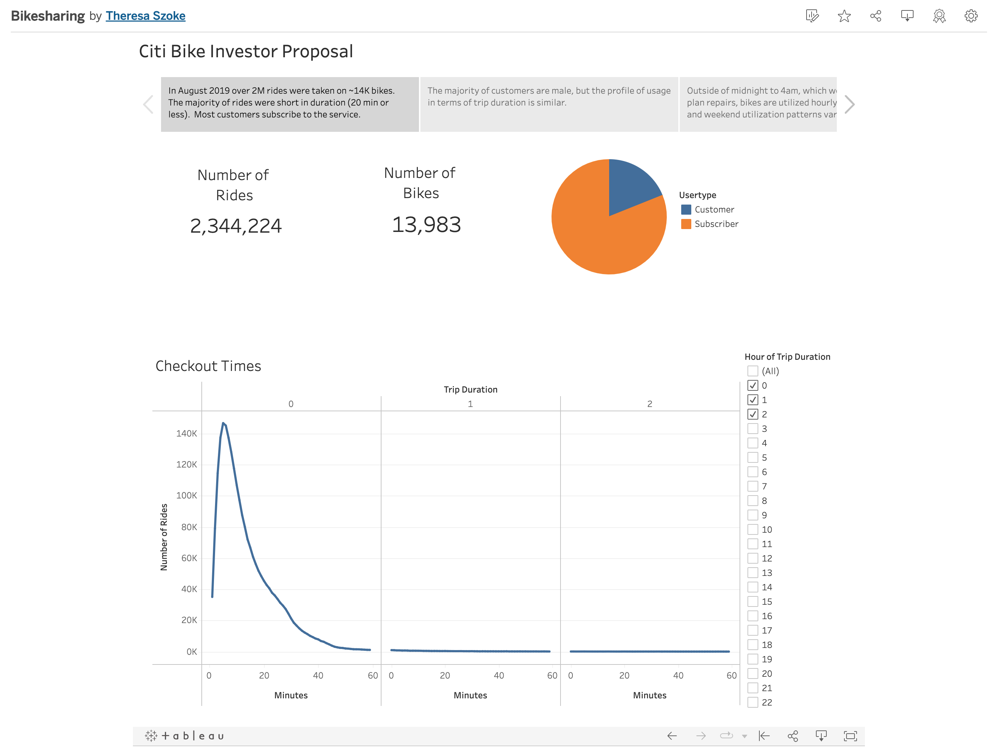
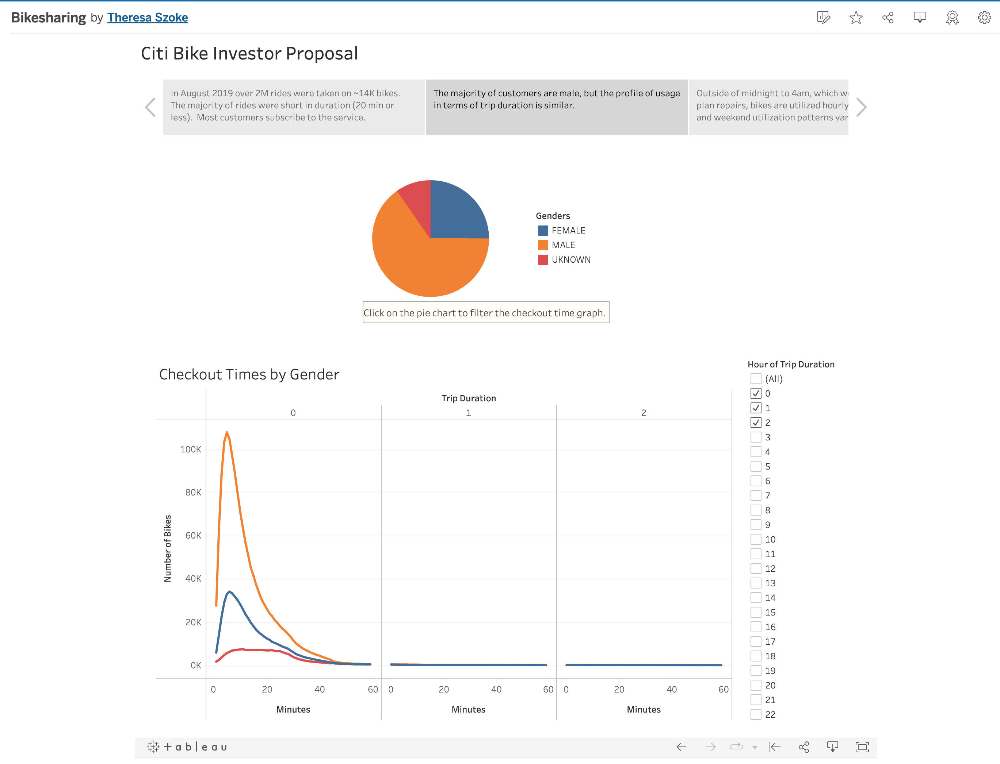
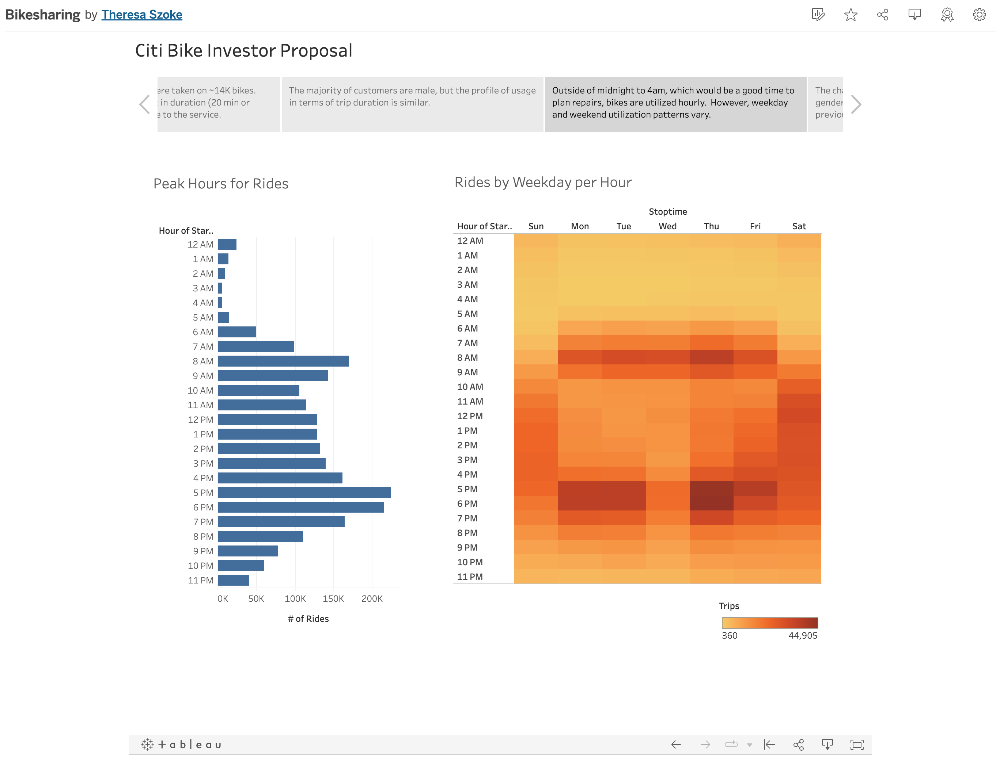
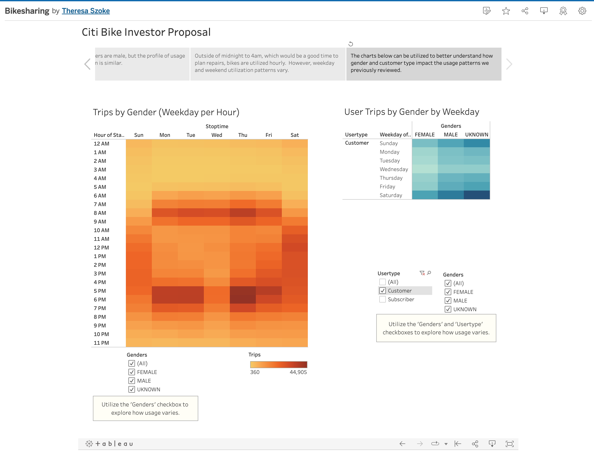
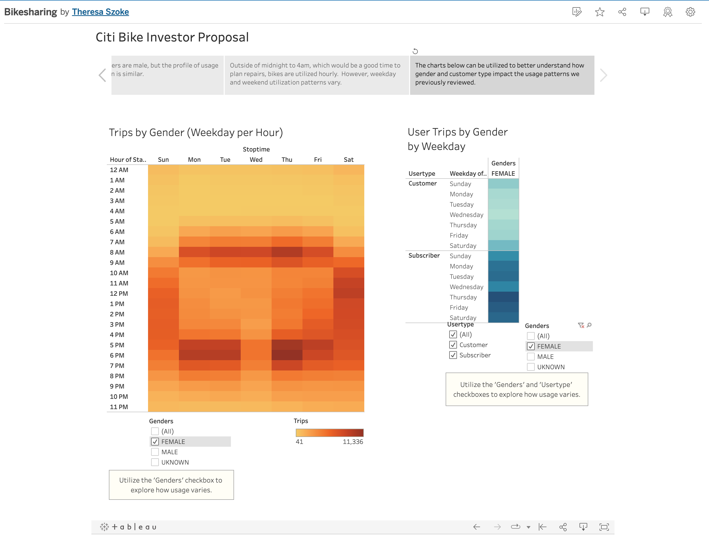

# Bikesharing for Des Moines

## Overview
Following a road trip to NYC, where we utilized Citibike bikesharing to get around the city, we wanted to explore the feasibility of creating a new bikesharing business in Des Moines, Iowa.  We found potential investors, but needed to do some additional analytics to better understand the value proposition.  We utilize Citibike ridesharing data from August 2019 to create some analytics in Tableau to better understand bikeshare business.

## Results
In order to help potential investors understand the bikesharing business, the following visualizations were prepared:

1) An overview of the August 2019 bikesharing ride data from NYC which identified:

    a) The number of rides of 2,344,224
  
    b) The number of bikes of 13,983
  
    c) The number of rides by duration, which indicated that most rides are shorter than 20 minutes
  
    
  
2) An interactive customer profile which shows:

    a) The percentage of customers by gender, which showed that the vast majority of customers are male
    
    b) The number of rides by duration and gender, which indicated that all genders tend to have similar profiles of mostly rides of 20 minutes or less
    
    
    
3) A review of peak hours of usage for the bikes, both overall and by day of week.  This helped to identify a quiet time for repairs and also showed that usage varies by weekday and weekend.

    

4) A review of peak hours or peak days by gender and/or user type.  These help us understand nuances between non-subscribers and lower usage customers by allowing us to filter out males and/or subscribers and take a closer look at the lower volume data.

    
    
    

## Summary

As the [Bikesharing Proposal](https://public.tableau.com/app/profile/theresa.szoke/viz/Bikesharing_16682860620810/CitiBikeInvestorProposal?publish=yes) shows, we reviewed the bikesharing business from several perspectives:

1) Overall, we learned at NYC had over 2MM rides on approximately 14K bikes in the month of August.  The majority of customers subscribe to the service and the majority of rides are fairly short.

2) The majority of customers are male, but the usage profile in terms of trip durations is similar.

3) Bikes are used throughout the day, but notably less from midnight to 4am, which can be a good time to plan repairs. On weekdays, there is more usage during the morning and evening commute, while on weekends, the usage is higher during the middle of the day.

4) Non-subscriber customers use the service more on the weekends than the weekdays, and female customers tend to use the service as much on weekends as they do on weekdays, while male subscribers appear to be more likely to be regular commuters with the bikesharing service.

In order to help assess the comparability of the NYC bikesharing data to DesMoines, it would be helpful to layer some additional population data over the NYC data:

- What is the population density or office worker density related to the starting and ending station locations?  How does that compare to the population and office worker density in Des Moines? 

- What is the population density compared to the number of subscriber rides and the number of bikes.  We would need to plan how much initial investment in bikes is estimated for Des Moines.
